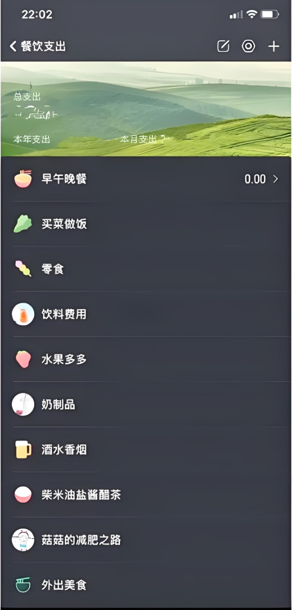

# 智能日常开支记录器APP竞品分析报告

日期: 2025年6月15日

### 1. 引言

本报告旨在对“智能日常开支记录器”APP进行竞品分析，识别其在市场中的定位、核心优势与潜在挑战。该产品以自然语言交互和集成大型语言模型（LLM）为核心，致力于解决传统记账应用操作繁琐的痛点。

### 2. 产品概述

“智能日常开支记录器”是一款通过自然语言处理技术，让用户能以最自然、高效的方式完成记账和财务分析的智能工具。其核心目标是打造一个以自然语言交互为核心的智能记账工具，提供概览式主页和对话式快捷操作入口。量化目标包括实现模糊语义查询的精准理解（错误率低于10%），提供动态可交互的数据图表，以及通过预算预警和个性化建议提升用户财务规划能力。目标用户画像包括学生党、职场新人及自由职业者。

### 3. 竞品类型与选择

鉴于“智能日常开支记录器”的创新特性，其主要竞品可分为以下几类：

* **传统记账APP：** 功能全面，但操作流程相对固定和复杂，如随手记、挖财。
* **极简记账APP：** 强调快速记账，简化操作步骤，但功能深度有限，如Timi时光记账。
* **新兴AI/智能记账工具：** 目前市场此类直接以LLM为核心的产品较少，但智能化是发展趋势。

### 4. 竞品对比分析

#### 4.1 核心交互与便捷性

* **智能日常开支记录器：** 采用**自然语言输入（文本/语音）**作为核心记账方式，用户只需通过聊天界面输入如“今天午饭花了20元”即可完成记账，LLM自动进行意图识别和实体提取，将输入转化为结构化数据。这种方式极大地**降低了操作门槛和学习成本**。

    * **以某app为例进行对比：** 
        根据该app的页面截图，用户在记录“餐饮支出”时，需要先进入“餐饮支出”类别，然后从列表中选择具体的子类别（如“早午晚餐”、“买菜做饭”、“零食”等），并手动输入金额。这个过程涉及到多次点击和滑动操作。相比之下，“智能日常开支记录器”的用户只需在聊天界面输入“午饭花了20元”，系统即可智能识别“午饭”为餐饮类别并记录金额，省去了繁琐的分类选择步骤，显著提升了记账效率和便捷性。
* **传统记账APP：** 通常需要用户手动选择分类、填写金额、备注等多个步骤，虽然功能全面，但**操作流程相对繁琐**。
* **极简记账APP：** 优化了记账流程，通过预设模板或快速选择，实现了较快的记账速度，但**仍需手动点选**。

#### 4.2 数据分析与智能化深度

* **智能日常开支记录器：** 凭借LLM的赋能，具备**深度智能分析能力**。用户可以进行**模糊语义查询**（如“这个月奶茶花了多少？”），系统能解析意图并返回所需数据。更进一步的是，它支持**自然语言描述图表需求**（如“画一个最近三个月，每个月餐饮和购物开销的柱状图”），LLM生成图表配置，后端查询数据后前端直接渲染，提供**动态、可交互的数据图表**。同时，产品目标包括通过预算预警和个性化建议提升用户财务规划能力。
* **传统记账APP：** 提供标准化的报表（如收支明细、分类饼图、趋势图），用户通常需要手动设置筛选条件和时间范围。其智能化主要体现在自动归类或周期性报表推送，**不具备自然语言理解和动态图表生成能力**。
* **极简记账APP：** 通常只提供基础的收支统计和简易图表，**不提供深入的财务分析或智能建议**。

#### 4.3 隐私与安全

* **智能日常开支记录器：** 明确指出所有用户数据默认存储在**本地设备的SQLite数据库中**，强调用户数据的隐私与安全。
* **传统与极简记账APP：** 大多数倾向于采用云端存储，强调数据加密和异地备份，但也存在用户对云端数据隐私的担忧。

#### 4.4 用户体验与页面结构

* **智能日常开支记录器：** 采用底部标签栏作为主导航，包含主页、报表、计划三个核心页面，并设置一个**悬浮“+”号按钮作为快速记账的入口**，直接进入智能记账助手（聊天界面）。主页提供核心财务摘要卡片、预算进度和近期交易列表的概览。整体设计体现了**概览与对话并重**的理念。
* **传统与极简记账APP：** 页面结构多为传统的列表、图表和表单组合，功能入口明确，但可能在视觉上信息量较大。

### 5. 竞争优势

* **颠覆性交互体验：** 自然语言交互是其最大的亮点，显著降低了用户记账的心理门槛，有望吸引大量“懒人记账”用户。
    * **具体优势体现（以随手记为例）：** 避免了传统记账APP（如随手记截图所示）中需要层层选择分类、子分类的繁琐操作，将记账过程极度简化为一次自然语言输入，更符合现代用户的交互习惯。
* **智能化深度：** LLM赋能使其能理解复杂的用户意图，提供更智能的数据查询、图表生成和财务建议，这是多数现有竞品无法比拟的。
* **数据可视化能力：** 动态生成用户自定义的图表，提供更直观、个性化的数据洞察。
* **隐私保护：** 本地数据存储满足了用户对数据隐私高度关注的需求。

### 6. 潜在挑战与劣势

* **LLM理解准确性挑战：** 尽管产品设定了“错误率低于10%”的目标，但在实际应用中，如何确保LLM对各种口语化、模糊、俚语表达的精准理解，是核心技术挑战。
* **用户习惯培养：** 用户需要适应与AI对话的记账方式，这与传统的表单填写习惯不同，可能存在一定的适应期。
* **功能广度：** 早期版本可能在一些高级功能（如投资管理、多币种、共享账本等）上不如成熟的传统记账APP全面。
* **数据同步与备份：** 本地存储虽然有隐私优势，但也可能在多设备同步和数据备份方面带来不便，未来若考虑云同步，需平衡隐私与便利性。

### 7. 市场机会与建议

* **抓住“AI+记账”风口：** 目前市场上深度融合AI的记账产品较少，该产品具有先发优势，可抢占“智能记账”的用户心智。
* **差异化营销：** 强调“像聊天一样简单记账”、“你的专属智能财务管家”等卖点，突出与传统记账APP的差异。
* **持续优化LLM：** 核心竞争力在于LLM的理解能力，需持续投入优化模型，提升识别准确率和语义丰富度。
* **逐步拓展功能深度：** 在保证核心智能记账体验的基础上，可根据用户反馈逐步扩展更多高级财务管理功能。
* **考虑数据备份方案：** 在保障隐私的前提下，可探索提供可选的、加密的云备份或数据导出功能，满足不同用户的数据安全需求。

### 8. 结论

“智能日常开支记录器”凭借其创新的自然语言交互和LLM驱动的智能化功能，在当前记账应用市场中展现出强大的差异化竞争优势和巨大的市场潜力。其成功将取决于核心AI技术的落地效果以及能否有效地引导用户接受并喜爱这种全新的记账体验。